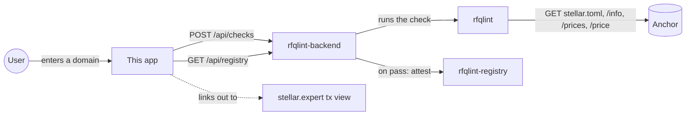

# rfqlint-frontend

Web UI for the SEP-38 conformance checker: enter an anchor's domain, run
the check, see a live pass/fail report, and browse every quote server
that's been verified and published to the
[on-chain registry](https://github.com/RFQLint/rfqlint-registry).
The fourth product on this shared design system, retargeted at SEP-38.

Part of a four-repo project:

- [`rfqlint`](https://github.com/RFQLint/rfqlint) — the checking library + CLI.
- [`rfqlint-backend`](https://github.com/RFQLint/rfqlint-backend) — the API this frontend calls.
- [`rfqlint-registry`](https://github.com/RFQLint/rfqlint-registry) — the Soroban contract results get published to.
- **This repo** — the surface for all three.



This repo has no logic of its own beyond presentation — every check and
every attestation is real work done by the backend and the contract.

## Table of contents

- [Glossary](#glossary)
- [Pages](#pages)
- [Design system](#design-system)
  - [Token reference](#token-reference)
  - [One design language, four palettes](#one-design-language-four-palettes)
  - [Accessibility](#accessibility)
- [Component tree](#component-tree)
- [Data flow](#data-flow)
- [Reading a report card](#reading-a-report-card)
- [Configuration](#configuration)
- [Running locally](#running-locally)
- [Verification](#verification)
- [Project layout](#project-layout)
- [Framework notes: built on Next.js 16](#framework-notes-built-on-nextjs-16)
- [Design decisions](#design-decisions)
- [What's not here yet](#whats-not-here-yet)
- [FAQ](#faq)
- [Contributing](#contributing)
- [License](#license)

## Glossary

See [`rfqlint`'s glossary](https://github.com/RFQLint/rfqlint#glossary)
for the underlying SEP-38 vocabulary (quote server, firm quote,
indicative price, delivery method).

## Pages

- `/` — enter an anchor's domain, run a check, see the report. A passing
  check's attestation transaction is linked to Stellar Expert.
- `/registry` — every domain checked so far, pass/fail, with a link to
  its on-chain attestation transaction where one exists.

## Design system

Same "liquid glass" mechanism as all three sibling frontends:
translucent frosted panels (`backdrop-filter: blur(18px)`), a CSS-only
drifting backdrop, pill controls, hairline borders, a diagonal sweep
highlight on hover.

### Token reference

| Token | Light | Dark | Used for |
|---|---|---|---|
| `--ink` | `#1a1d18` | `#eef0e6` | Primary text |
| `--bg` | `#eef0e6` | `#0d0f0a` | Page background — cool sage-tinted cream / near-black |
| `--bg-glow-a` / `--bg-glow-b` | `#d9c896` / `#a3c2ae` | `#3d3420` / `#1a2e22` | The two drifting background blobs — gold and sage |
| `--glass` / `--glass-strong` | `rgba(255,255,255,0.5)` / `0.72` | `rgba(255,255,255,0.045)` / `0.09` | Glass panel fills |
| `--hairline` | `rgba(70,75,55,0.18)` | `rgba(255,255,255,0.13)` | Panel borders |
| `--pass` / `--fail` | `#0f6e5c` / `#a3402c` | `#4fd8ba` / `#f0876c` | Status badges — same hex values across all four frontends |
| `--muted` | `#5f6355` | `#9ba192` | Secondary text |

### One design language, four palettes

| Product | Palette |
|---|---|
| `sep24-conformance-frontend` | Warm parchment / near-black, teal-tan glow |
| `soroban-ttl-doctor-frontend` | Cool slate / near-black, blue-violet glow |
| `sep31-conformance-frontend` | Warm terracotta / near-black, peach-rose glow |
| **This repo** | Cool sage / near-black, gold-sage glow |

Same mechanism every time; only the palette changes.

### Accessibility

Same three rules as every sibling frontend: `prefers-reduced-motion`
disables drift/sweep animation, status is never color-only (text label +
glyph alongside every badge), and every interactive element is a real
`<button>`/`<input>`/`<a>` rather than a styled `<div>`.

## Component tree

```text
app/
  layout.tsx        root layout, renders .backdrop-field once
  page.tsx           home page: <Nav /> + <CheckForm />
  registry/page.tsx    registry page: <Nav /> + client-fetched list
components/
  Nav.tsx              top nav
  CheckForm.tsx        client component: input + submit -> lib/api.runCheck -> <ReportView />
  ReportView.tsx        renders a ConformanceReport as a glass card
lib/
  api.ts                typed fetch wrappers for the backend API
```

## Data flow

`CheckForm` and the registry page are Client Components calling
`lib/api.ts` directly against `NEXT_PUBLIC_API_URL` — no Next.js
server-side data fetching, same architecture as all three siblings, for
the same reason: the backend already exists as its own deployable
service with nothing server-side to protect.

## Reading a report card

```text
┌──────────────────────────────────────────────┐
│ testanchor.stellar.org       [Not conformant] │
│ https://testanchor.stellar.org/sep38          │
│                                                │
│ ✔ stellar.toml is reachable and valid TOML    │
│ ✔ stellar.toml declares ANCHOR_QUOTE_SERVER   │
│ ✔ GET /info is reachable                      │
│ ✔ /info returns valid JSON                    │
│ ✔ assets is present and every entry valid     │
│ ✔ GET /prices responds with a well-formed...  │
│ ✘ /price returns valid JSON                   │
│    HTTP 502, and the body failed to parse...  │
└──────────────────────────────────────────────┘
```

That's real, current output shape — SDF's test anchor genuinely produces
this report right now (see the backend's own README).

## Configuration

| Variable | Default | Description |
|---|---|---|
| `NEXT_PUBLIC_API_URL` | `http://localhost:3003` | Base URL of `rfqlint-backend`. |

## Running locally

```sh
cp .env.example .env.local   # point at your backend if not on localhost:3003
npm install
npm run dev
```

Needs `rfqlint-backend` running — this app has nothing to show
without it.

## Verification

Same honest standard as all three sibling frontends: `next build`
succeeds, the served HTML was inspected via `curl` for the expected
`backdrop-field`/`glass sweep` markup, and a full round trip was run
against a locally running backend — including a real check against
`testanchor.stellar.org`. What wasn't confirmed: how the glass/blur/sweep
effect actually renders in a browser, since no browser automation tool
was available in this environment.

## Project layout

```text
app/
  layout.tsx
  page.tsx
  globals.css
  registry/page.tsx
components/
  Nav.tsx
  CheckForm.tsx
  ReportView.tsx
lib/
  api.ts
```

## Framework notes: built on Next.js 16

Same situation as all three siblings: scaffolded with
`create-next-app@latest`, producing Next.js 16.3.4 — this repo's
`AGENTS.md` points at version-matched bundled docs for that reason. This
app is simple enough that almost none of Next 16's breaking changes
actually apply here.

## Design decisions

**Why does this frontend exist as a near-duplicate of the other three
instead of something original?** Deliberately — see
[One design language, four palettes](#one-design-language-four-palettes).
Consistency and lower risk across a family of related tools, with real
identity coming from palette and domain-specific content, not from
reinventing the mechanism four times.

**Why do `--pass`/`--fail` use identical hex values across all four
frontends?** Status color carries meaning independent of brand — a user
who's used one of these tools shouldn't have to relearn "green" and "red"
in the next one.

**Why gold/sage for this one specifically?** No deep symbolism intended
beyond "visually distinct from the other three and pleasant on its own
terms" — see [One design language, four palettes](#one-design-language-four-palettes).
Deliberately not leaning into a literal "gold = money/quotes" cliché
beyond a light thematic nod, since the actual differentiator across all
four products is meant to be the palette mechanism, not a forced metaphor
per product.

**Why does this app show the raw HTTP status in a failure message (e.g.
"HTTP 502...") instead of a friendlier, translated error?** Because
`ReportView` renders exactly what the backend's report contains, and the
backend in turn renders exactly what `rfqlint`'s checks
produce — see that repo's README for why surfacing the real HTTP status
was itself a fix made partway through building the checker, replacing a
more opaque JSON-parse error. Re-translating it into something friendlier
here would undo that specific improvement for anyone debugging a real
failure.

## What's not here yet

- **No manual light/dark toggle** — follows system preference only, same
  gap tracked on all three sibling frontends.
- **No pagination on `/registry`** — fine at today's volume.
- **No loading skeleton for the report card** — only a text "Checking…"
  button state.

## FAQ

**Does this app work if the backend is down?** It renders (static
shells), but every interactive feature fails with a caught network error.

**Can I point this at a mainnet deployment?** Yes — set
`NEXT_PUBLIC_API_URL` to that deployment's URL.

**Why does a "Not conformant" badge sometimes show mostly passing
checks?** Because `passed` requires *zero* failures, not a majority —
one failing check (like the real `/price` 502 documented in the backend's
README) is enough, even with six other checks passing.

## Contributing

The [What's not here yet](#whats-not-here-yet) list mirrors the gaps
already tracked on all three sibling frontends — worth checking whether a
fix belongs on all four at once.

## License

Apache-2.0
